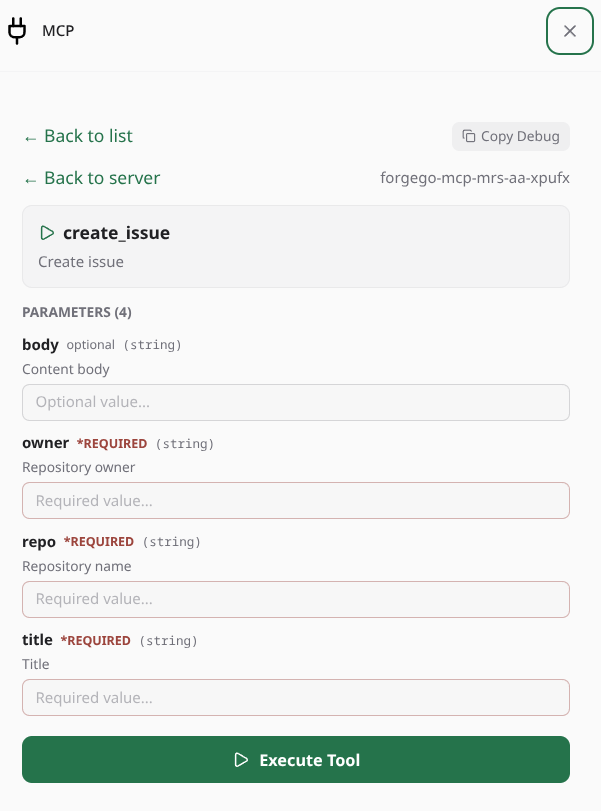

# paseo-mcp-tools plugin

<p align="center">
  
</p>

Provides an inline UI for checking MCP servers available to an agent session with additional functionality per MCP. Uses the most authoritative list per provider CLI and verifies actual session inclusion with live probes.

(**Paseo** is an agent orchestrator: AI coding agents run on paseo daemons, each managing workspaces, tools, and permissions.)

## What it does

- **Pill** above the composer shows `MCP n` (live servers for that agent). Badge updates via `mcp.list`, shared between pill and modal.
- **Live discovery** per-CLI via isolated `providers/<id>.ts` (`opencode` → `opencode mcp list`, `claude` → `~/.claude.json` live, `antigravity` → `~/.gemini/config/mcp_config.json`, etc.) + Paseo-injected `StoredAgentRecord.mcpServers`. Groups by `source.label`, dedupes by name.
- **Paseo Built-in Host MCP**: Automatically discovers Paseo's host daemon control plane (`/mcp/agents?callerAgentId=...`) as a first-class MCP server (`Paseo (Builtin)`), exposing all 60+ live tools (workspaces, browser automation, schedules, terminals, agent orchestration).
- **Detail & Live Health**: Server tap reveals real-time status dots, latency, server instructions, and full tool declarations.
- **Interactive Tool Runner (User Execution)**: Users can execute any discovered MCP tool directly from the UI without prompting the agent. Features a dynamic schema-driven form with `*REQUIRED` validation, type coercion (boolean, number, object, array, union/nullable types), live tool execution via host RPC (`mcp.call_tool`), and output inspection with 1-tap clipboard copying.
- **Real-Time Tool Search**: Server Detail view features a real-time search input filtering across tool names and descriptions, making servers with large command sets (like Paseo, Forgejo, Chrome DevTools) fast and easy to navigate.
- **Diagnostics**: Full polymorphic probe checklist verifying paths, permissions, and agent records across hosts.
- **Settings & Visual Flair**: Health polling rate (1s to 5m, or paused) plus corner radius, density, surface style, and brand accent, persisted atomically daemon-side and applied live.
- **About**: Plugin branding, version, repository and issue links, live environment facts, and 1-tap Copy Diagnostics for issue triage.

## Built with paseo-plugin-helper

This plugin is built on [paseo-plugin-helper](https://github.com/xpufx/paseo-plugin-helper), the shared developer toolkit and design system for Paseo plugins:

- **UI**: `registerComposerPill`, `ModalBody`, `Tabs`, `Card`, `Button`, `Badge`, `StatusDot`, `SearchInput`, `EmptyState`, `CodeBlock`, `TextInput`, `Toggle`, `FormRow`, `ActionBar`, `AboutSection`, `PluginThemeProvider` with configurable visual flair
- **Data**: `useRpcQuery` with stale-cache busting, `usePluginSettings` with optimistic updates, `defineContract` / `defineSettingsContract` for end-to-end typed RPC
- **Daemon**: `createPluginLogger`, `PluginStorage` with atomic writes, `registerSettingsRpc`, `redactSecrets`, `parseJsonc` / `tryParseJsonc`, `safeSpawn`, `stripAnsi`, `withTimeout`, `stampVersion`
- **MCP**: Zero-dependency `McpClient` for stdio and HTTP/SSE health checks and tool calls, with session handling, SSE response parsing, stderr ring buffering, and process tree cleanup

## Screenshots

| MCP Overview & Status | Server Detail & Live Health |
| :---: | :---: |
|  |  |

| Interactive Tool Runner & Execution | Host Probe Diagnostics |
| :---: | :---: |
|  |  |

## Supported Providers

| Provider | Probe Mechanism | Status |
|---|---|---|
| **Paseo** (`paseo`) | Built-in host daemon MCP control plane (`~/.paseo/config.json` + live daemon HTTP session) | **Fully tested & verified (60+ tools)** |
| **Antigravity** (`antigravity`, `antigravity-acp`) | Global `~/.gemini/config/mcp_config.json` + `~/.antigravity/mcp_config.json` | **Fully tested & verified** |
| **OpenCode** (`opencode`) | Live `opencode mcp list` daemon CLI command + config | **Fully tested & verified** |
| **Pi** (`pi`) | User canonical `~/.pi/.mcp.json` / project overrides + heuristics | **Fully tested & verified** |
| **Claude** (`claude`) | User `~/.claude.json` / project `.claude.json` heuristics | **Tested against real active configs** *(without live subscription session)* |
| **CodeX** (`codex`) | Global `~/.codex/config.toml` / project `.codex/config.toml` | **Provided as-is** *(without guarantees)* |

## Dropping in New Providers

Adding a new tool/CLI probe (e.g. Cursor, Windsurf, Zed, Roo, Cline) is black-box and takes 2 simple steps:
1. Create `providers/<id>.ts` declaring candidate config paths using `discoverFromCandidates()` (or live CLI RPC) with `export default <id>Probe`.
2. Add a 1-line re-export to `providers/catalog.ts`: `export { default as <id> } from "./<id>";`.

See the complete step-by-step guide in the [write-mcp-provider skill](.agents/skills/write-mcp-provider/SKILL.md) (`.agents/skills/write-mcp-provider/SKILL.md`). Run `npm test` to automatically verify the probe satisfies the contract.

## Layout

| File | Owns |
|---|---|
| `index.ts` | Wiring only — `handle(mcp.list)`, `handle(mcp.read)`, `handle(mcp.health)`, `handle(mcp.call_tool)`, `handle(mcp.diagnose)`, `addClientSide` |
| `mcp.shared.ts` | zod RPC contracts & shared types (`ToolInfoSchema`, `callMcpTool`, etc.) |
| `mcp.server.ts` | `discoverLiveServers()`, tool runner execution bridge, and polymorphic diagnostic handlers |
| `discovery/extract.ts` | Universal heuristic MCP parser (JSON/JSONC, comments, trailing commas, URL safe) & candidate discovery |
| `discovery/types.ts` | Core contracts (`McpProbe`, `ProbeContext`, `ProbeResult`) |
| `providers/<id>.ts` | Per-CLI live probe — isolated, contract `McpProbe` (`antigravity.ts`, `claude.ts`, etc.) |
| `providers/paseo.ts` | Dedicated host daemon probe discovering Paseo control plane & tools |
| `providers/catalog.ts` | 1-line re-export catalog for zero-boilerplate probe registration |
| `health/health.server.ts` | Zero-dependency helper MCP client for stdio and HTTP/SSE — `instructions`, schema-aware `tools`, and `callMcpServerTool` |
| `mcp-query.client.tsx` | `useMcpQuery` / `useMcpHealthQuery` via helper React Query hooks, stale-cache busting, `enabled` guards, settings-driven polling |
| `pill.client.tsx` | Pill, tabbed modal (Servers, Diagnostics, Settings, About), server details, and interactive Tool Runner UI |
| `settings.server.ts` | Atomic settings storage plus typed get/update/reset RPC handlers via the helper |
| `scripts/version.mjs` | Build-time version stamper via helper `stampVersion` |
| `docs/TEST_METHODOLOGY.md` | Test procedures, adapter verification, and QA methodology |

## Install & Updates

```bash
# from git (recommended)
paseo plugin add xpufx/paseo-mcp-tools

# update to latest release
paseo plugin update mcp-tools

# or from a local checkout (path-linked for development)
paseo plugin install "$PWD"

# reload daemon process after local edits
paseo plugin reload mcp-tools
```

`pluginsEnabled: true` required. Use `paseo plugin logs mcp-tools` for diagnostics and runtime logs. Failed reload stays failed (Paseo doesn't restore).
