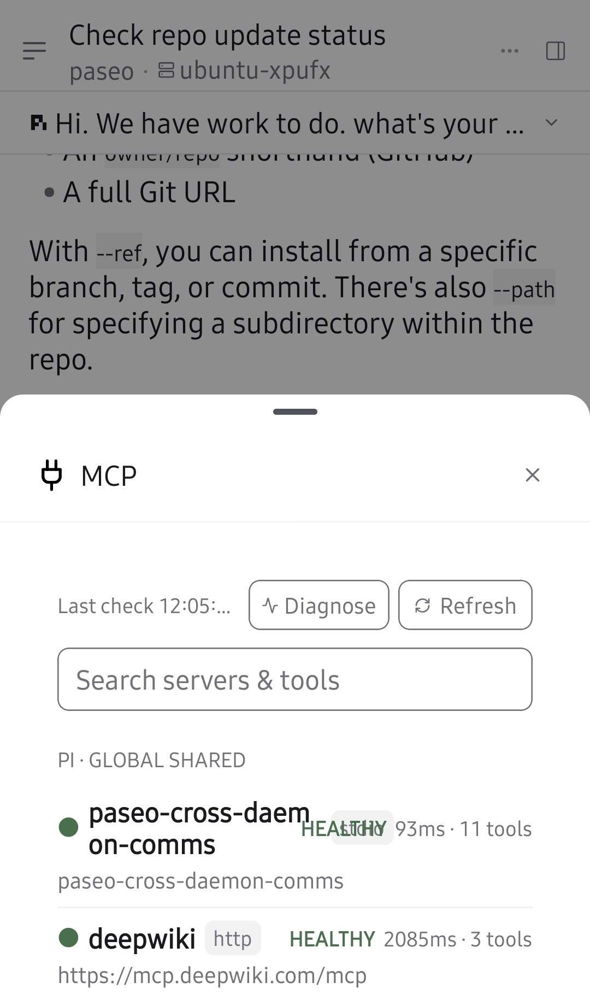
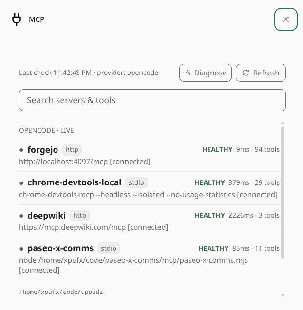
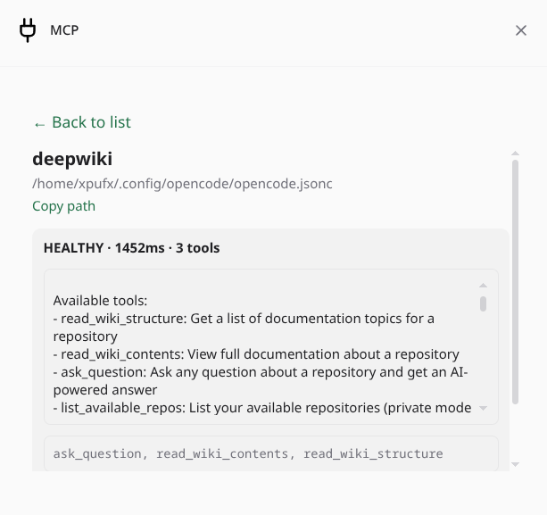
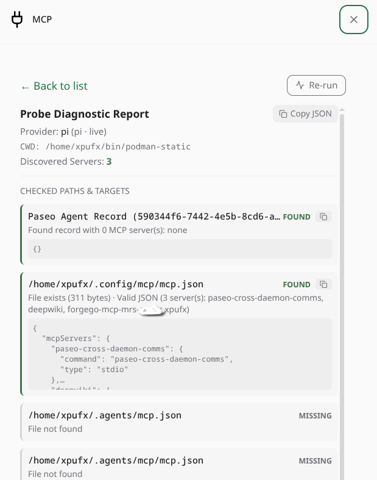

# paseo-mcp-tools plugin

<p align="center">
  
</p>

Provides an inline UI for checking MCP servers available to an agent session with additional functionality per MCP. Uses the most authoritative list per provider CLI and verifies actual session inclusion with live probes.

(**Paseo** is an agent orchestrator: AI coding agents run on paseo daemons, each managing workspaces, tools, and permissions.)

## What it does

- **Pill** above the composer shows `MCP n` (live servers for that agent). Badge updates via `mcp.list`, shared between pill and modal.
- **Live discovery** per-CLI via isolated `providers/<id>.server.ts` (opencode → `opencode mcp list`, claude → `~/.claude.json` live, etc.) + Paseo-injected `StoredAgentRecord.mcpServers`. Groups by `source.label`, dedupes by name.
- **Paseo catalog** collapsed at bottom (18 tools) — tap to expand.
- **Search** filters servers + tools client-side.
- **Detail** tap → `mcp.read` (redacted) + live `mcp.health` → `instructions` + `tools` via generic health client.

## Screenshots

| MCP Overview & Status | Server Detail & Live Health | Host Probe Diagnostics |
| :---: | :---: | :---: |
|  |  |  |

## Supported Providers

| Provider | Probe Mechanism | Status |
|---|---|---|
| **OpenCode** (`opencode`) | Live `opencode mcp list` daemon CLI command + config | **Fully tested & verified** |
| **Pi** (`pi`) | User canonical `~/.pi/.mcp.json` / project overrides + heuristics | **Fully tested & verified** |
| **Claude** (`claude`) | User `~/.claude.json` / project `.claude.json` heuristics | **Tested against real active configs** *(without live subscription session)* |
| **CodeX** (`codex`) | Global `~/.codex/config.toml` / project `.codex/config.toml` | **Provided as-is** *(without guarantees)* |

## Dropping in New Providers

Adding a new tool/CLI probe (e.g. Cursor, Windsurf, Zed, Roo, Cline) is black-box and takes 2 simple steps:
1. Create `providers/<id>.server.ts` declaring candidate config paths using `discoverFromCandidates()`.
2. Add your probe to `providers/registry.server.ts`.

See the complete step-by-step guide in the [write-mcp-provider skill](.agents/skills/write-mcp-provider/SKILL.md) (`.agents/skills/write-mcp-provider/SKILL.md`). Run `npm test` to automatically verify the probe satisfies the contract.

## Layout

| File | Owns |
|---|---|
| `index.ts` | Wiring only — `handle(mcp.list)`, `handle(mcp.read)`, `handle(mcp.health)`, `handle(mcp.diagnose)`, `addClientSide` |
| `mcp.shared.ts` | zod RPC contracts & shared types (client/server boundary safe) |
| `mcp.server.ts` | `discoverLiveServers()` (with `${provider}:${cwd}` cache) + handlers |
| `providers/extract.server.ts` | Universal heuristic MCP parser (JSON/JSONC, comments, trailing commas, URL safe) |
| `providers/<id>.server.ts` | Per-CLI live probe — isolated, contract `McpProbe` |
| `health/health.server.ts` | Generic `Client` health (stdio/http) — `instructions` + `tools` |
| `mcp-query.client.tsx` | `useMcpQuery` shared pill/modal, 30m timer + manual Refresh |
| `pill.client.tsx` | Pill + `McpModal` (search, Last check, Refresh, Diagnose, detail, collapsed Paseo) |

## Install

```bash
# from this checkout (keeps path-linked, reload on start)
paseo plugin install "$PWD"

# or from git
paseo plugin add xpufx/paseo-mcp-tools
```

`pluginsEnabled: true` required. `paseo plugin reload mcp-tools` after edits; `paseo plugin logs mcp-tools` for errors. Failed reload stays failed (Paseo doesn't restore).
